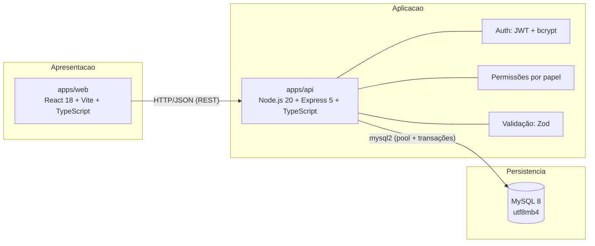

# Arquitetura do POLAR

## Visão em três camadas



Em **produção**, a API serve o build estático do React na mesma origem (1 serviço, 1 URL). Em **desenvolvimento**, Vite roda em `:5173` e a API em `:3000` com CORS restrito.

## Estrutura do monorepo (pnpm workspaces)

```text
apps/
  api/                       # Backend
    src/modules/<dominio>/   # rotas + controller + service + schemas Zod por módulo
    src/shared/
      database/repositories/ # INTERFACES + implementação JSON (dev)
      database/mysql/        # implementação MySQL (oficial)
      permissions/           # RBAC central
      middlewares/           # auth, rate-limit de login
      errors/                # erros tipados + contrato único de erro
    tests/integration/       # Vitest + Supertest (API HTTP real)
  web/                       # Frontend
    src/features/<tela>/     # páginas por funcionalidade
    src/components/          # design system (Button, Card, Table, ...)
    src/services/            # cliente HTTP tipado
database/                    # schema.sql (DDL MySQL) + seed.ts
docs/                        # esta documentação
scripts/                     # migração de dados legados
```

## Padrões aplicados

| Padrão | Onde | Por quê |
| --- | --- | --- |
| **MVC por módulo** | `routes → controller → service` | Separação de transporte, orquestração e regra de negócio |
| **Repository** | `shared/database/repositories/*` são **interfaces**; JSON e MySQL são implementações | Trocar persistência sem tocar em regra de negócio (foi exatamente assim que a migração JSON→MySQL aconteceu) |
| **Injeção de dependência** | `shared/services.ts` monta o contêiner | Testes usam banco em memória sem mocks de rede |
| **Máquina de estados** | `ocorrencias.service.ts` | O fluxo institucional não pode ser burlado |
| **Append-only** | `ocorrencia_historico` | Auditoria: sem UPDATE/DELETE em nenhuma camada |
| **Transações (TCL)** | `mysql/ocorrencia.repository.mysql.ts` | Status + histórico + auditoria gravados atomicamente |

## Decisões registradas (ADRs)

- [Migração da lógica principal para Node.js + TypeScript](decisao-migracao-node-typescript.md)
- [Adoção do MySQL como banco oficial](decisao-mysql.md)

## Fluxo de uma requisição

```mermaid
sequenceDiagram
    participant P as Professor (browser)
    participant A as API Express
    participant S as OcorrenciasService
    participant R as MysqlOcorrenciaRepository
    participant DB as MySQL

    P->>A: POST /ocorrencias (JWT)
    A->>A: authenticate (JWT) + authorize (REGISTRAR_OCORRENCIA)
    A->>A: Zod valida e sanitiza o body
    A->>S: create(input, actor)
    S->>S: aluno válido? duplicata em 5min?
    S->>R: create(ocorrencia, historico)
    R->>DB: BEGIN; INSERT ocorrencia; INSERT historico; COMMIT
    S->>R: audit.create(...)
    A-->>P: 201 { data }
```
