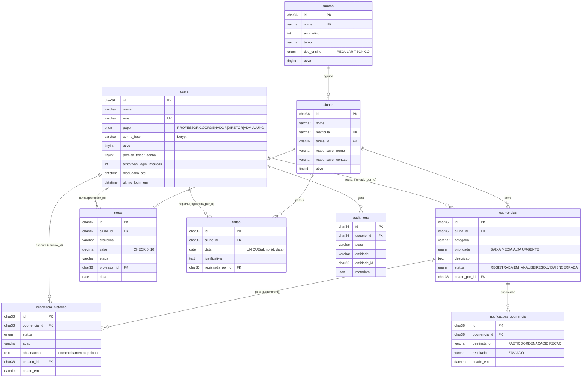

# Modelo Relacional do POLAR (PostgreSQL 15)

Fonte da verdade: [database/schema.sql](../../database/schema.sql). Encoding UTF-8 (padrão do PostgreSQL), porque acentuação PT-BR é requisito de negócio.

## DER

(Tabela auxiliar `categorias_ocorrencia` — id, nome único, ativa — é o catálogo de referência das categorias oficiais. Hoje o formulário aceita texto livre e a ocorrência guarda o nome da categoria como texto, o que preserva o valor histórico mesmo se a categoria for renomeada depois.)

## Dicionário de dados (resumo por tabela)

| Tabela | Papel no domínio | Chaves e restrições |
| --- | --- | --- |
| `users` | Contas que autenticam | PK `id`; UNIQUE `email`; `papel` do tipo `papel_usuario`; senha só em hash |
| `turmas` | Agrupamento institucional | PK `id`; UNIQUE `nome`; `tipo_ensino` é `REGULAR` ou `TECNICO`; inativação lógica (`ativa`) |
| `alunos` | Entidade de dados (não autentica) | PK `id`; UNIQUE `matricula`; FK `turma_id`; inativação lógica |
| `categorias_ocorrencia` | Tipos oficiais de ocorrência | PK `id`; UNIQUE `nome`; desativa sem excluir |
| `ocorrencias` | Núcleo do domínio | FKs `aluno_id`, `criado_por_id`; ENUMs de status/prioridade; sem DELETE |
| `ocorrencia_historico` | Trilha imutável | FKs; **append-only: só INSERT em todas as camadas** |
| `notificacoes_ocorrencia` | Encaminhamentos automáticos | FK da ocorrência; destinatário validado e resultado do envio registrado |
| `notas` | Módulo acadêmico (bônus) | FK aluno/professor; CHECK `valor` 0–10 |
| `faltas` | Módulo acadêmico (bônus) | UNIQUE `(aluno_id, data)` impede falta duplicada no dia |
| `audit_logs` | Auditoria de ações sensíveis | `metadata` JSONB; índice por entidade |

## Índices

- `ocorrencias`: `status`, `aluno_id`, `criado_por_id`, `criado_em` — cobrem a lista filtrada, o histórico por aluno (reincidência), a visão "minhas ocorrências" do professor e a ordenação temporal.
- `ocorrencia_historico`: `ocorrencia_id` — timeline do detalhe.
- `audit_logs`: `(entidade, entidade_id)` e `criado_em`.
- Funcionais sobre `LOWER()` em `users(email)`, `users(nome)`, `alunos(matricula)` e `turmas(nome)`: no PostgreSQL a comparação é sensível a caixa, então as buscas usam `LOWER()` e sem estes índices virariam seq scan.

## Regras de integridade que o banco garante

1. FKs impedem ocorrência sem aluno, aluno sem turma, histórico sem ocorrência.
2. Os tipos `status_ocorrencia`, `papel_usuario`, `prioridade_ocorrencia` e `tipo_ensino` impedem valores fora do domínio (defesa em profundidade — o backend valida antes).
3. UNIQUEs impedem e-mail, matrícula e nome de turma duplicados, e falta duplicada por dia.
4. CHECK impede nota fora de 0–10.
5. Datas em `TIMESTAMPTZ(3)` UTC geradas pelo backend — o banco nunca inventa data de negócio.
