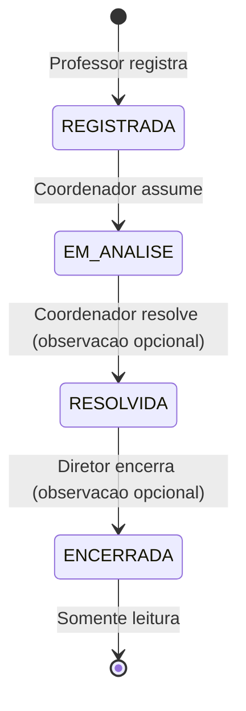

# Fluxo De Ocorrencias

## Máquina de estados

Não existe pular etapa, retroceder, cancelar nem reabrir. Transição inválida → `409` e **nada é gravado**.

## Registro

O professor registra com: aluno válido e ativo, categoria, prioridade (`BAIXA`, `MEDIA`, `ALTA`, `URGENTE`) e descrição com pelo menos 10 caracteres. O backend deriva autor e data do usuário logado (não são digitáveis). A ocorrência nasce `REGISTRADA` e o primeiro registro de histórico é criado na mesma transação.

Duplicata (mesmo autor + aluno + categoria + descrição em 5 minutos) é bloqueada com `409`.

## Edição (regra fechada na v3)

- **Quem**: somente o autor.
- **Quando**: somente enquanto `REGISTRADA`.
- **Rastreabilidade**: toda edição gera registro de histórico "Ocorrencia editada pelo autor".
- Depois de `EM_ANALISE`, nem o autor edita (`409`). Terceiros nunca editam (`403`), inclusive ADM.

## Análise e resolução

O coordenador assume (`REGISTRADA → EM_ANALISE`) e resolve (`EM_ANALISE → RESOLVIDA`). Na resolução pode registrar uma **observação/encaminhamento** (ex: "conversa com o aluno; família comunicada") — gravada no histórico, imutável como todo o resto.

## Encerramento

Apenas o diretor encerra (`RESOLVIDA → ENCERRADA`), também com observação opcional. Encerramento é ato institucional formal: a ocorrência vira somente leitura para sempre.

## Histórico

Cada evento (criação, edição, transição) insere um registro com ação, status, autor, data e observação. Não existe rota de UPDATE/DELETE do histórico em nenhuma camada; tentativas retornam `405`.

## Visibilidade (regra fechada na v3)

| Papel | Enxerga |
| --- | --- |
| PROFESSOR | Somente as ocorrências que ele registrou (lista, detalhe e histórico; alheias → `403`) |
| COORDENADOR / DIRETOR / ADM | Todas |
| ALUNO | Nenhuma — lista vazia, detalhe `403` (sem vínculo `Usuario` → `Aluno`, nega por padrão) |

A decisão de escopo é única, em `escopoDeOcorrencias()` (`apps/api/src/modules/ocorrencias/ocorrencias.service.ts`), e vale igualmente para a listagem, o acesso por id e o **dashboard** — o agregado obedece ao mesmo recorte. Qualquer papel novo cai em "nenhuma" até ser decidido explicitamente.

## Permissões por etapa

| Transição | Papel exclusivo |
| --- | --- |
| `REGISTRADA → EM_ANALISE` | COORDENADOR |
| `EM_ANALISE → RESOLVIDA` | COORDENADOR |
| `RESOLVIDA → ENCERRADA` | DIRETOR |

Professor não altera status em hipótese alguma. A UI esconde os botões, mas é o **backend** que bloqueia (`403`).
