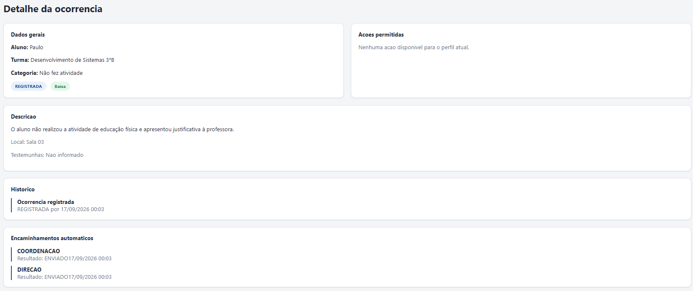
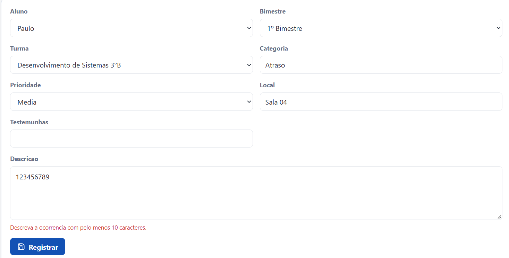
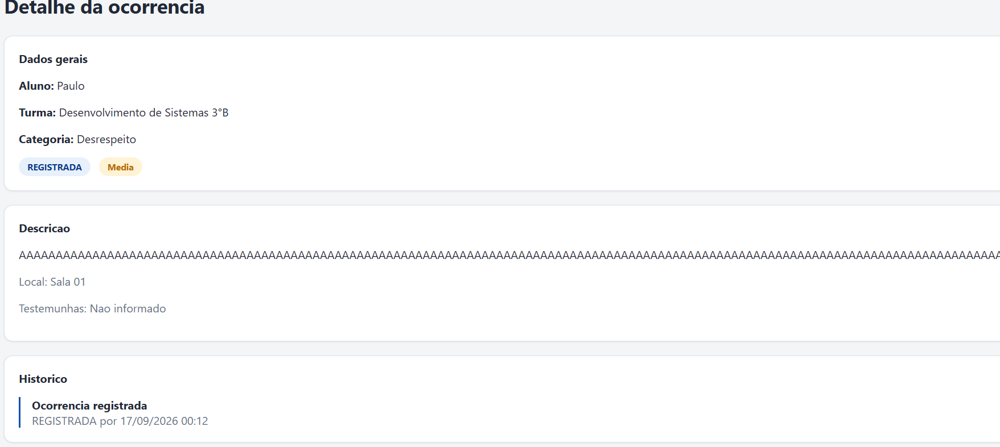
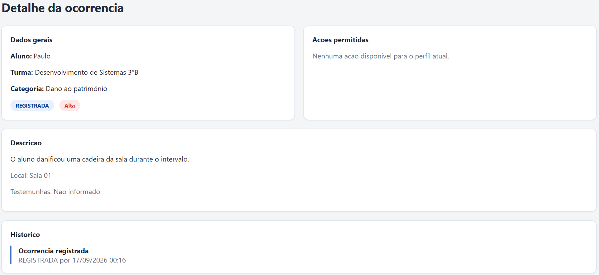

# Evidências de testes — Acentuação e limites de ocorrência

## Objetivo

Validar o cadastro de ocorrências quanto ao suporte a caracteres com acentuação, limite mínimo e máximo da descrição e uso da categoria "Dano ao patrimônio".

## Ambiente

* Aplicação: POLAR
* Perfil utilizado: Professor
* Navegador: Google Chrome
* Ambiente: desenvolvimento local
* Branch: `feature/qa-02-evidencias-acentuacao`

---

## Caso 1 — Caracteres com acentuação

**Entrada utilizada**

* Categoria: `Não fez atividade`
* Descrição: `O aluno não realizou a atividade de educação física e apresentou justificativa à professora.`

**Resultado esperado**

A ocorrência deve ser cadastrada com sucesso e os caracteres acentuados devem permanecer intactos.

**Resultado obtido**

Ocorrência cadastrada com sucesso e caracteres acentuados preservados.

**Status:** ✅ Sucesso

---

## Caso 2 — Descrição com 9 caracteres

**Entrada utilizada**

* Categoria: `Atraso`
* Descrição: `123456789`
* Quantidade de caracteres: 9

**Resultado esperado**

O sistema deve impedir o cadastro, pois a descrição deve possuir no mínimo 10 caracteres.

**Resultado obtido**

O cadastro foi impedido e o formulário apresentou a mensagem de validação informando que a descrição deve possuir pelo menos 10 caracteres.

**Status:** ✅ Falha esperada confirmada

---

## Caso 3 — Descrição com 2000 caracteres

**Entrada utilizada**

- Categoria: `Desrespeito`
- Descrição: texto composto por exatamente 2000 caracteres.
- Quantidade de caracteres: 2000
- A quantidade de caracteres foi conferida utilizando um contador de caracteres online.

**Resultado esperado**

A ocorrência deve ser cadastrada com sucesso, pois 2000 caracteres correspondem ao limite máximo permitido.

**Resultado obtido**

A ocorrência foi cadastrada com sucesso utilizando uma descrição de exatamente 2000 caracteres.

**Status:** ✅ Sucesso

---

## Caso 4 — Categoria "Dano ao patrimônio"

**Entrada utilizada**

* Categoria: `Dano ao patrimônio`
* Descrição: `O aluno danificou uma cadeira da sala durante o intervalo.`
* Prioridade: `ALTA`

**Resultado esperado**

A ocorrência deve ser cadastrada com sucesso e a categoria deve ser persistida preservando a acentuação.

**Resultado obtido**

Ocorrência cadastrada com sucesso com a categoria `Dano ao patrimônio`.

**Status:** ✅ Sucesso

---

## Conclusão

Os quatro cenários previstos foram executados. A aplicação aceitou caracteres com acentuação, rejeitou corretamente uma descrição abaixo do limite mínimo de 10 caracteres, aceitou uma descrição no limite máximo de 2000 caracteres e cadastrou corretamente uma ocorrência com a categoria `Dano ao patrimônio`.
